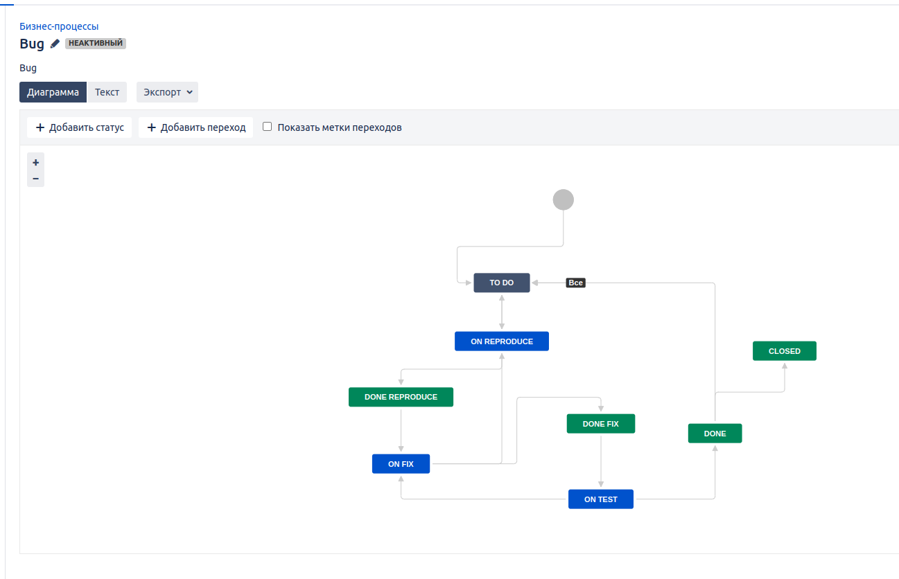
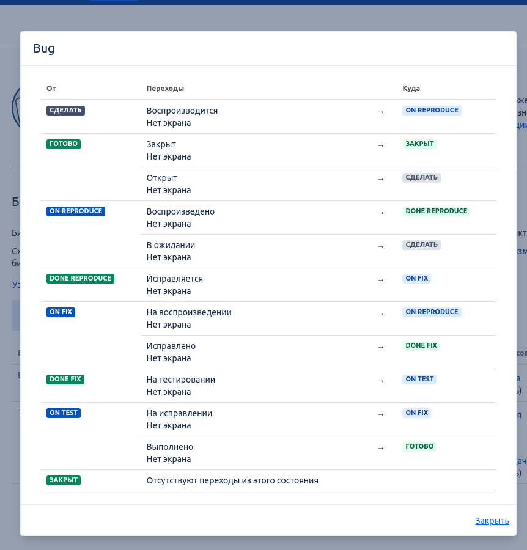
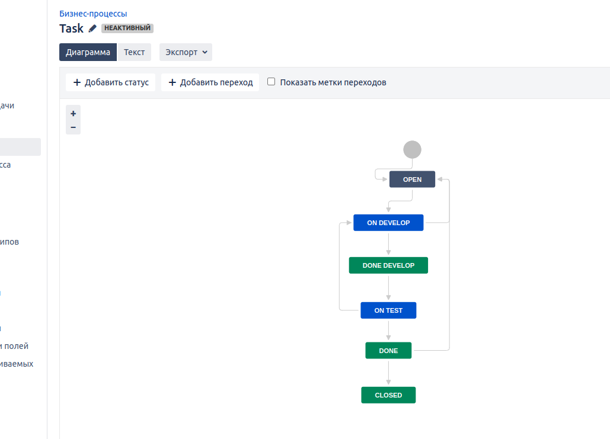
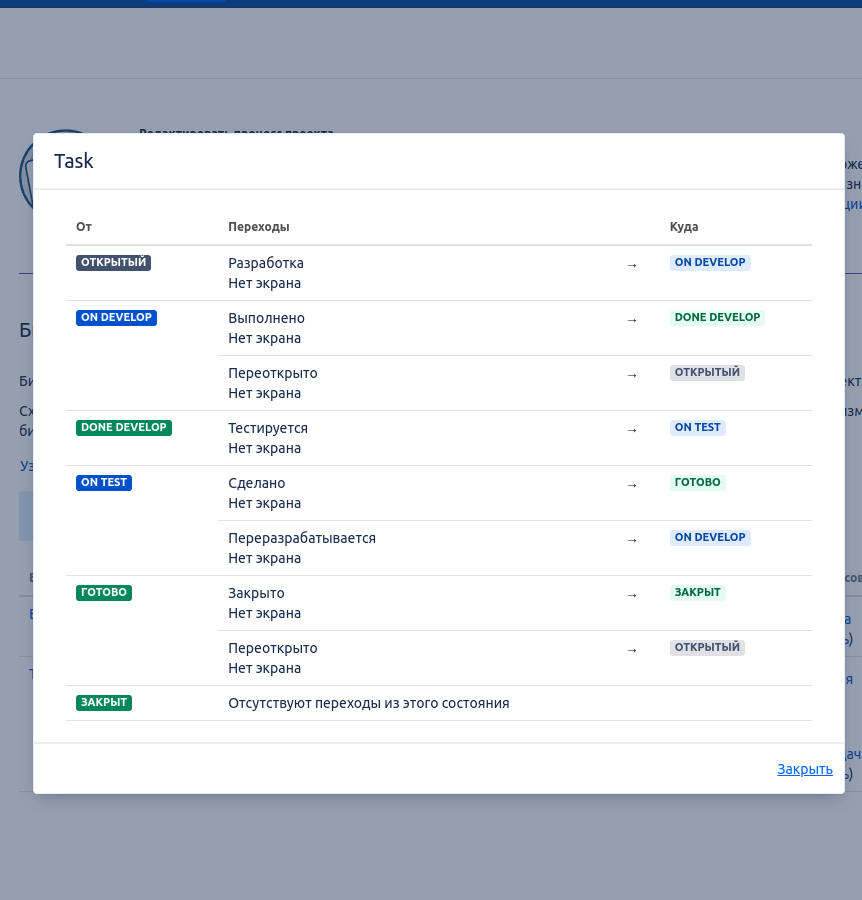
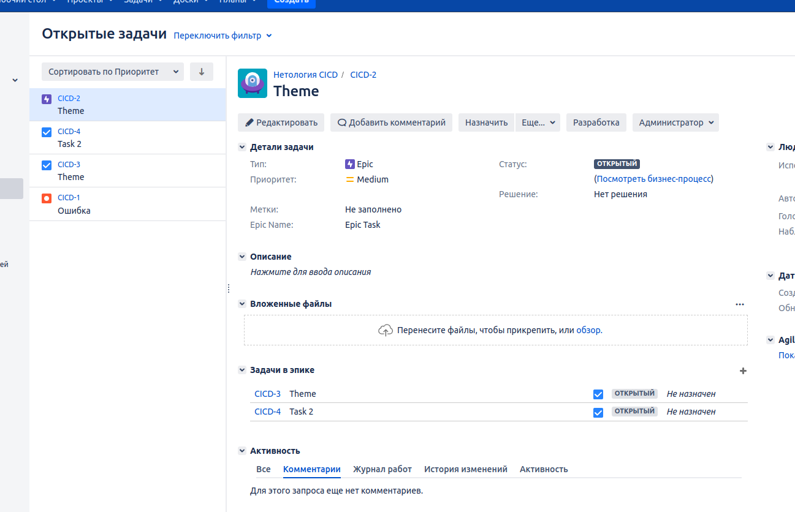
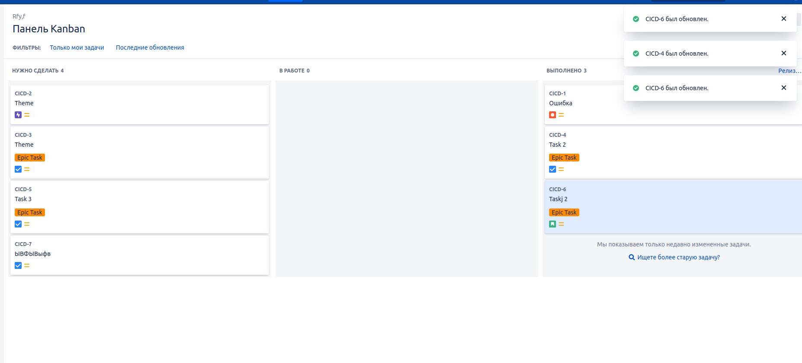
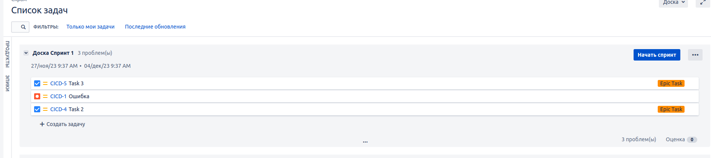
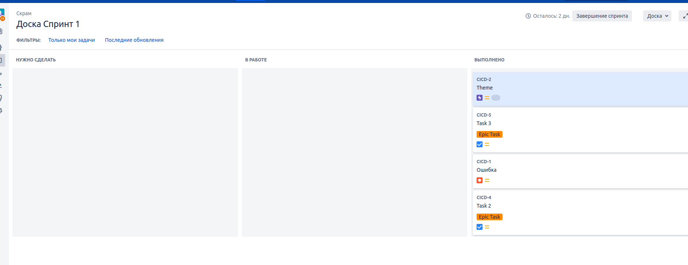

# Домашнее задание к занятию 7 «Жизненный цикл ПО»

## 1. Создайте задачу с типом bug, попытайтесь провести его по всему workflow до Done.

## 2. Создайте задачу с типом epic, к ней привяжите несколько задач с типом task, проведите их по всему workflow до Done.

## Решения

